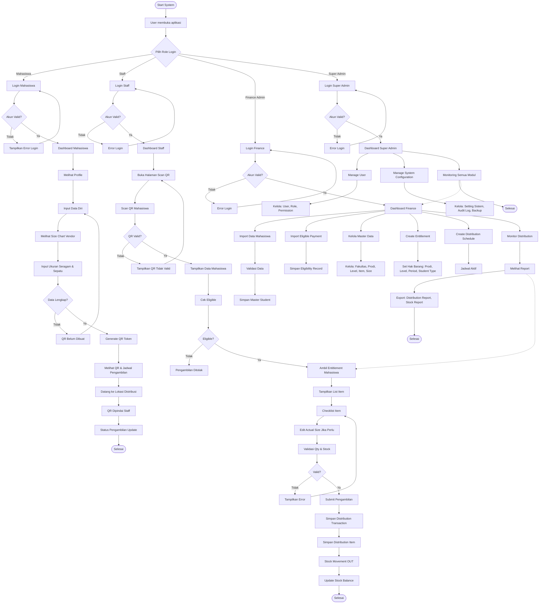

<p align="center">
  
</p>

<h1 align="center">Horizon-UniStock</h1>

<p align="center">
  Sistem Distribusi Seragam & Inventory Management — Berbasis Web untuk Finance Universitas
</p>

---

## Tentang

**Horizon-UniStock** adalah sistem berbasis web untuk mengelola proses distribusi seragam mahasiswa. Dibangun untuk menggantikan proses manual (Google Form, Google Sheet, barcode & checklist manual, rekap Excel) dengan sistem yang terintegrasi, cepat, dan terstruktur.

**Masalah sebelumnya:**
- Data tersebar di banyak file
- Sulit tracking siapa menerima barang apa
- Risiko double submit & salah ukuran
- Proses hari-H lambat
- Report harus rekap manual
- Stok tidak terhubung dengan distribusi

---

## Tujuan

1. Membuat proses distribusi Freshman lebih cepat
2. Mengurangi kesalahan manual
3. Melacak barang yang diberikan ke mahasiswa
4. Menyimpan data distribusi secara terstruktur
5. Menyediakan fondasi inventory management

---

## Fitur Berdasarkan Role

### Super Admin
- Kelola seluruh data master
- Kelola user & role (Spatie Permission)
- Audit log aktivitas sistem
- Backup & restore database

### Admin (Finance)
- Import data mahasiswa dari Excel
- Import data eligible / pembayaran
- Kelola program studi, level, item, size
- Atur entitlement (hak barang) — tanpa coding ulang
- Atur periode distribusi & jadwal
- Export report distribusi & inventory (Excel)

### Staff
- Scan QR identity mahasiswa
- Cari mahasiswa manual berdasarkan NIM
- Lihat entitlement & ukuran yang diharapkan
- Checklist item yang diberikan
- Edit actual size (jika berbeda dari input)
- Submit transaksi pengambilan

### Student
- Login ke sistem
- Lihat profil
- Input ukuran seragam
- Update ukuran (maksimal 1 kali)
- Lihat size chart vendor
- Dapatkan QR identity
- Lihat jadwal pengambilan

---

## Alur Distribusi Freshman

```
Finance Import Data
       ↓
Mahasiswa Login → Input Ukuran
       ↓
Validasi Data → Generate QR
       ↓
Jadwal Distribusi
       ↓
Staff Scan QR → Validasi Eligible
       ↓
Tampilkan Item → Checklist Barang
       ↓
Submit Pengambilan → Update Inventory
       ↓
Report
```

---

## Flowchart Lengkap Sistem



---

## Tech Stack

| Teknologi | Keterangan |
|-----------|-----------|
| **Framework** | Laravel 10 |
| **PHP** | ^8.1 |
| **Database** | MySQL |
| **Frontend** | Blade + Tailwind CSS |
| **Build Tool** | Vite 5 |
| **Auth** | Laravel Breeze / Fortify |
| **Permission** | Spatie Laravel Permission |
| **QR Code** | Simple QR Code |
| **QR Scanner** | HTML5 QR Scanner |
| **Import/Export** | Laravel Excel |

---

## Instalasi

```bash
# 1. Clone project
git clone https://github.com/username/horizon-unistock.git

# 2. Masuk ke folder project
cd horizon-unistock

# 3. Install PHP dependencies
composer install

# 4. Copy environment file
copy .env.example .env

# 5. Generate app key
php artisan key:generate

# 6. Setup database di .env
# DB_DATABASE=horizon_unistock
# DB_USERNAME=root
# DB_PASSWORD=

# 7. Jalankan migrasi
php artisan migrate --seed

# 8. Install frontend dependencies
npm install
npm run build
```

## Menjalankan Aplikasi

```bash
# Via Laragon — Start All, lalu buka:
http://localhost/Horizon-UniStock/public

# Atau via Artisan
php artisan serve
# Buka http://127.0.0.1:8000
```

---

## Lisensi

[MIT License](https://opensource.org/licenses/MIT)
