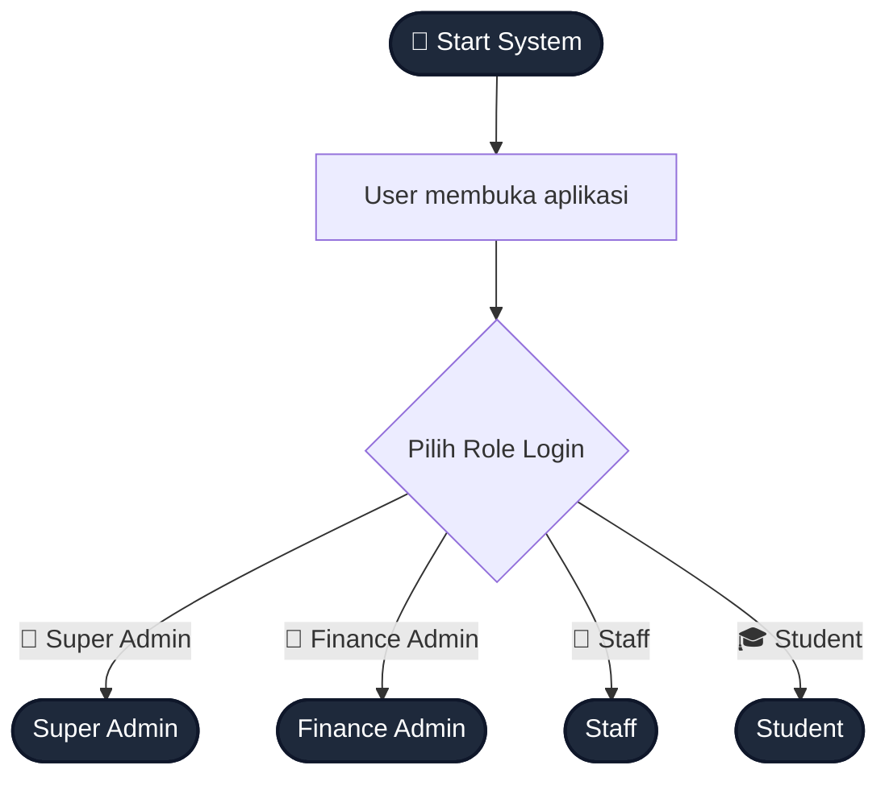
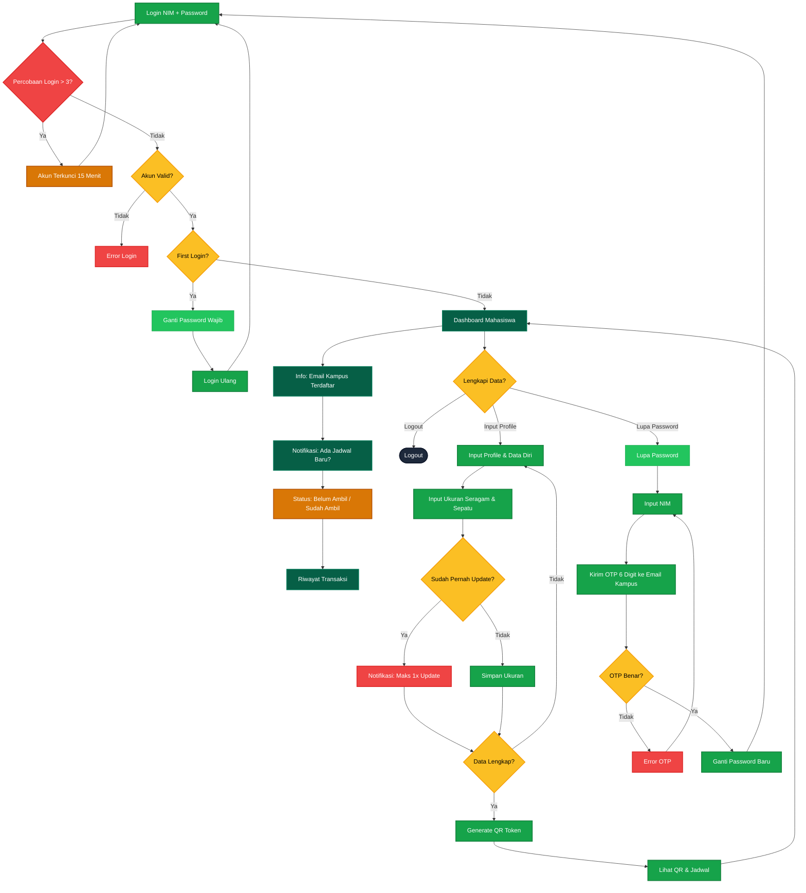
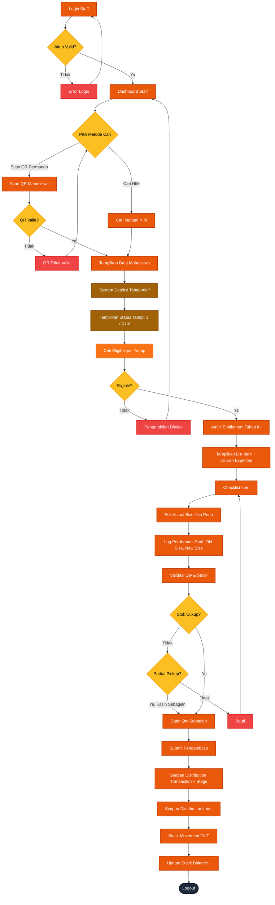
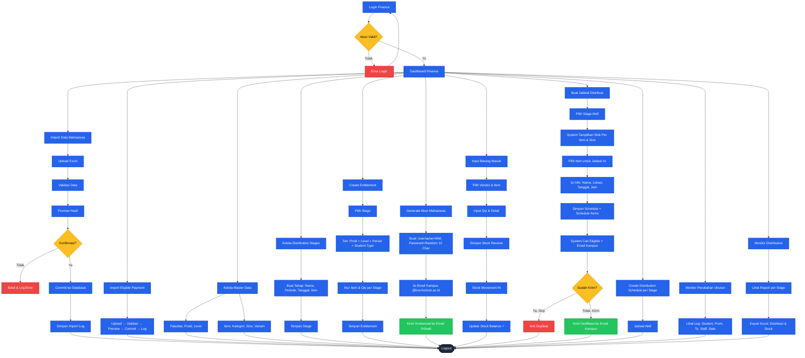
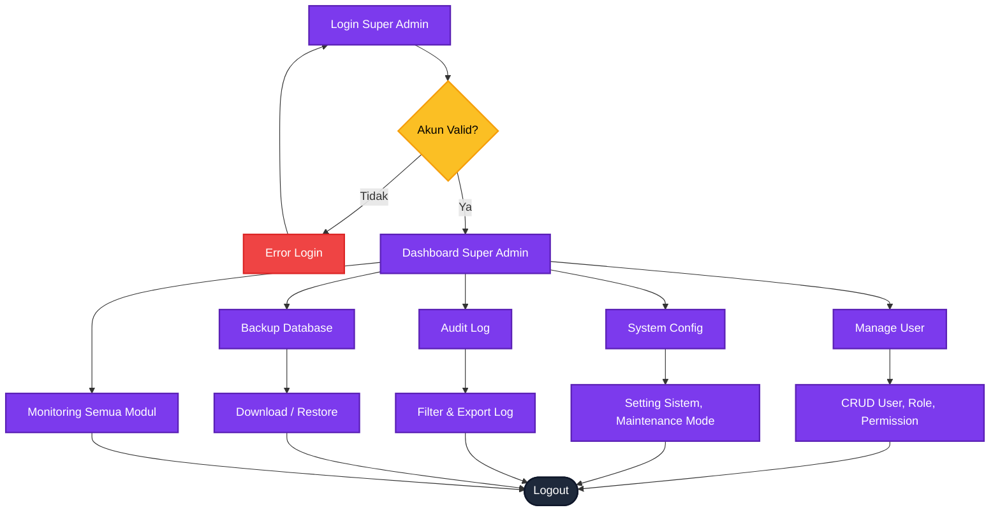
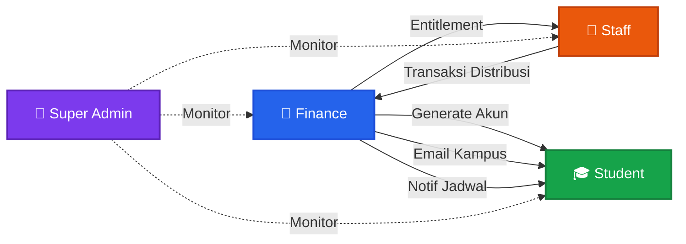
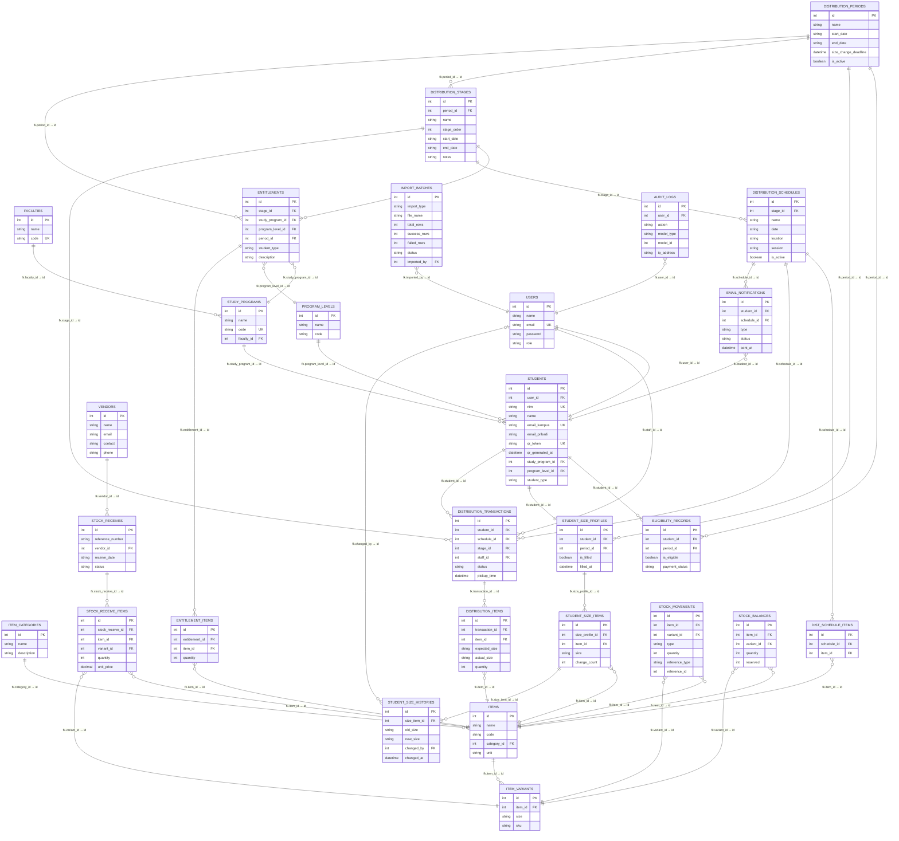

<h1 align="center">Horizon-UniStock</h1>

<p align="center">
  Sistem Distribusi Seragam & Inventory Management — Berbasis Web untuk Finance Universitas
</p>

---

## Daftar Isi

1. [Tentang](#1-tentang)
2. [Tujuan](#2-tujuan)
3. [Scope MVP](#3-scope-mvp)
4. [Fitur Per Role](#4-fitur-per-role)
5. [Flowchart Lengkap Sistem](#5-flowchart-lengkap-sistem)
6. [Penjelasan Flowchart](#6-penjelasan-flowchart)
7. [Database Design](#7-database-design)
8. [Sistem Arsitektur](#8-sistem-arsitektur)
9. [Security Design](#9-security-design)
10. [Manajemen Data & Import](#10-manajemen-data--import)
11. [Risiko & Mitigasi](#11-risiko--mitigasi)
12. [Fallback Hari-H](#12-fallback-hari-h)
13. [Testing Scenarios](#13-testing-scenarios)
14. [Timeline Development](#14-timeline-development)
15. [Fase Lanjutan](#15-fase-lanjutan)
16. [Jobdesk Tim](#16-jobdesk-tim)
17. [Kesimpulan Akhir](#17-kesimpulan-akhir)
18. [Tech Stack](#18-tech-stack)
19. [Instalasi](#19-instalasi)
20. [Lisensi](#20-lisensi)

---

## 1. Tentang

**Horizon-UniStock** adalah sistem berbasis web untuk mengelola proses distribusi seragam mahasiswa. Dibangun untuk menggantikan proses manual yang sebelumnya menggunakan:

- Google Form
- Google Sheet
- Barcode manual
- Checklist manual
- Rekap Excel

**Permasalahan utama dari sistem lama:**

- Data tersebar di banyak file
- Sulit tracking siapa menerima barang apa
- Risiko double submit
- Risiko salah ukuran
- Proses hari-H lambat
- Report membutuhkan rekap manual
- Data stok belum terhubung dengan distribusi

**Solusi yang dirancang:**

```
Student Data
     ↓
Size Management
     ↓
QR Identity
     ↓
Staff Distribution
     ↓
Inventory Movement
     ↓
Finance Report
```

---

## 2. Tujuan

Tujuan utama:

1. Membuat proses distribusi Freshman lebih cepat
2. Mengurangi kesalahan manual
3. Melacak barang yang diberikan ke mahasiswa
4. Menyimpan data distribusi secara terstruktur
5. Menyediakan fondasi inventory management

---

## 3. Scope MVP

### Target MVP

Tanggal implementasi: **20 Juli 2026**

Fokus: **Freshman / Mahasiswa Baru**

MVP tidak memprioritaskan seluruh sistem inventory enterprise.

**Prioritas MVP:**

1. Mahasiswa input ukuran
2. Sistem membuat QR
3. Staff scan QR
4. Staff melakukan distribusi
5. Sistem mencatat transaksi
6. Report tersedia

---

### Freshman vs Continuing Student

#### Freshman

Karakteristik:

- Mahasiswa baru
- Data awal dari registrasi
- Input ukuran pertama
- QR dibuat setelah profile lengkap

#### Continuing Student

Karakteristik:

- Mahasiswa existing
- Update ukuran berdasarkan periode
- Mengikuti aturan Finance

#### Kesimpulan

Tidak perlu membuat dua aplikasi. Gunakan field `student_type`:

- `freshman`
- `continuing`

Perbedaan hanya:

- Onboarding
- Email
- Ukuran
- Eligible

Flow distribusi tetap sama.

---

### Out of Scope MVP

Tidak termasuk dalam MVP:

- Continuing full system
- POS eceran
- FIFO
- VIVO
- Cost revenue
- Stock opname kompleks
- Email automation penuh
- Integrasi SIS
- Mobile app native

---

## 4. Fitur Per Role

### 👑 Super Admin

| Fitur | Keterangan |
|-------|-----------|
| Kelola User & Role | CRUD user, atur role & permission (Spatie) |
| System Config | Atur setting sistem global, maintenance mode |
| Audit Log | Lihat seluruh aktivitas pengguna |
| Backup Database | Backup & restore data |
| Monitoring | Pantau semua modul (Mahasiswa, Staff, Finance) |

### 💼 Admin (Finance)

| Fitur | Keterangan |
|-------|-----------|
| Import Data Mahasiswa | Upload Excel → Validasi → Preview → Commit → Import Log |
| Import Eligible Payment | Upload data pembayaran mahasiswa |
| Kelola Master Data | Fakultas, Prodi, Level, Item, Size, Kategori |
| Kelola Distribution Stages | Atur tahap distribusi (Tahap 1: Almamater, Tahap 2: PDH, dll) |
| Create Entitlement | Atur hak barang (Prodi + Level + Period + Student Type + Stage) |
| Generate Akun Mahasiswa | Username=NIM, Password=random 12 char, kirim ke email pribadi |
| Input Email Kampus | Isi email kampus (@krw.horizon.ac.id) untuk setiap mahasiswa |
| Stock Receive | Input barang masuk dari vendor → Stock IN → Balance + |
| Buat Jadwal Distribusi | Pilih stage → Lihat stok ready per item & size → Pilih item distribusi → Isi lokasi & jadwal → System kirim notifikasi (anti duplikat) |
| Monitor Perubahan Ukuran | Lihat siapa, dari ukuran apa, ke ukuran apa, staff siapa |
| Monitor & Report | Export Distribution Report & Stock Report (Excel) |

### 👷 Staff

| Fitur | Keterangan |
|-------|-----------|
| Scan QR (Identitas Permanen) | QR 1x seumur hidup, scan untuk identifikasi mahasiswa |
| Cari NIM Manual | Fallback jika QR gagal |
| Lihat Tahap Distribusi Aktif | System otomatis deteksi tahap yang sedang berjalan |
| Lihat Data Mahasiswa | Profile, entitlement per tahap, ukuran |
| Checklist Item Tahap Ini | Centang barang tahap yang aktif |
| Edit Actual Size | Jika berbeda dari input mahasiswa — dicatat siapa staffnya |
| Validasi Stock | Cek ketersediaan stok per size sebelum submit |
| Partial Pickup | Jika stok kurang, bisa kasih sebagian |
| Submit Transaksi | Simpan → Stock OUT → Balance - |

### 🎓 Student / Mahasiswa

| Fitur | Keterangan |
|-------|-----------|
| Login | Username=NIM, Password=random (dari Finance) |
| Ganti Password (Wajib) | Wajib ganti password saat first login |
| Dashboard | Lihat info akun & status |
| Profile | Lihat & lengkapi data diri |
| Input Ukuran | Seragam & sepatu, lihat size chart vendor |
| Update Ukuran | Maksimal 1 kali perubahan |
| QR Identity (Permanen) | QR 1x generate, berlaku seumur hidup, tidak kadaluarsa |
| Lihat Jadwal Per Tahap | Jadwal pengambilan per stage (Tahap 1, 2, 3) |
| Lupa Password | Input NIM → OTP 6 digit ke email kampus → Ganti password |

---

## 5. Flowchart Lengkap Sistem

### Kode Warna

| Warna | Role |
|-------|------|
| 🟣 Ungu | Super Admin |
| 🔵 Biru | Finance Admin |
| 🟠 Oranye | Staff |
| 🟢 Hijau | Student |

---

### 5.1 Flow Start System — Pilih Role



---

### 5.2 Flow Student / Mahasiswa



---

### 5.3 Flow Staff



---

### 5.4 Flow Finance Admin



---

### 5.5 Flow Super Admin



---

### 5.6 Koneksi Antar Role



---

## 6. Penjelasan Flowchart

### 6.1 Alur Mahasiswa

| Langkah | Detail |
|---------|--------|
| Login | Username = NIM, Password = 12 char random dari Finance |
| Batas Login Gagal | Maksimal 3x percobaan, akun terkunci 15 menit |
| First Login | Wajib ganti password sebelum akses fitur lain |
| Dashboard | Info email kampus, notifikasi jadwal, status pengambilan, riwayat |
| Email Kampus | Sudah terisi otomatis oleh Finance (@krw.horizon.ac.id) |
| Notifikasi Jadwal | Masuk ke email kampus saat Finance membuat jadwal distribusi baru |
| Profile Lengkap | Harus isi data diri & ukuran seragam |
| Update Ukuran | Maksimal 1 kali perubahan |
| QR Token | Otomatis generate setelah data lengkap |
| Status Pengambilan | Bisa dilihat di dashboard: Belum Ambil / Sudah Ambil |
| Riwayat Transaksi | Lihat detail item & waktu pengambilan |
| Lupa Password | Kirim OTP 6 digit (A-Z, a-z, 0-9) ke email kampus |
| Logout | Bisa logout kapan saja dari dashboard |

### 6.2 Alur Staff

| Langkah | Detail |
|---------|--------|
| Metode Cari | Scan QR permanen (utama) atau Cari NIM Manual (fallback) |
| QR Identitas | QR 1x seumur hidup, scan untuk identifikasi mahasiswa |
| Deteksi Jadwal | System deteksi jadwal distribusi aktif hari ini |
| Tampilkan Item | Tampilkan item yang harus diberikan sesuai jadwal ini |
| Eligible | Cek status pembayaran & eligibility per tahap |
| Checklist | Centang item satu per satu |
| Actual Size | Staff bisa edit — dicatat log: staff, old size, new size |
| Cek Stok Ready | Validasi ketersediaan stok per size sebelum konfirmasi |
| Partial Pickup | Jika stok kurang, staf bisa pilih "Kasih Sebagian" |
| Transaksi | Simpan per jadwal → Kurangi stok → Update balance |
| Logout | Setelah selesai shift |

### 6.3 Alur Finance

| Langkah | Detail |
|---------|--------|
| Import | Upload Excel → Validasi → Preview → Commit → Import Log |
| Distribution Stages | Buat tahap distribusi (Tahap 1: Almamater, Tahap 2: PDH, dll) |
| Stock Receive | Input barang masuk dari vendor |
| Entitlement | Atur hak barang per Prodi + Level + Period + Student Type + Stage |
| Generate Akun | Username=NIM, Password=random, kirim ke email pribadi |
| Email Kampus | Finance isi email @krw.horizon.ac.id per mahasiswa |
| Buat Jadwal | Pilih stage → Lihat stok ready per item & size → Pilih item → Isi info jadwal (nama, lokasi, tanggal, jam) |
| Notifikasi | System cari eligible + kirim email notifikasi ke mahasiswa yg belum ambil item-item tersebut (anti duplikat) |
| Monitor Ukuran | Lihat log perubahan ukuran: siapa, dari/ke, staff siapa, tanggal |
| Report | Export Distribution & Stock Report (Excel) per stage |
| Logout | Setelah selesai |

### 6.4 Alur Super Admin

| Langkah | Detail |
|---------|--------|
| Manage User | CRUD user, atur role & permission |
| System Config | Setting global aplikasi |
| Audit Log | Pantau semua aktivitas sistem |
| Backup | Backup & restore database |
| Monitoring | Pantau semua modul dari satu dashboard |
| Logout | Setelah selesai |

---

## 7. Database Design

### Legend Relasi

| Simbol | Arti | Contoh |
|--------|------|--------|
| `\|\|--\|\|` | 1 : 1 | User ↔ Student |
| `\|\|--o{` | 1 : M (zero or more) | Faculty → Study Programs |
| `\|\|--\|{` | 1 : M (one or more) | Entitlement → Entitlement Items |
| `}o--o{` | M : M | — |
| `}o--\|{` | M : M (mandatory) | — |

### Penjelasan Tipe Data

| Tipe | Keterangan |
|------|-----------|
| `int` | Integer (angka bulat) |
| `string` | Teks variable length |
| `text` | Teks panjang |
| `decimal` | Angka desimal (harga, berat) |
| `boolean` | true/false |
| `date` | Tanggal saja |
| `datetime` | Tanggal + waktu |
| `json` | Data JSON |
| `FK` | Foreign Key (hubungan antar tabel) |
| `PK` | Primary Key (identifier utama) |
| `UK` | Unique Key (harus unik) |

---

### ERD Lengkap Semua Tabel



---

### Penjelasan Detail Per Tabel

---

#### `users`

| Kolom | Tipe | Keterangan |
|-------|------|-----------|
| `id` | int (PK) | Identifier unik user |
| `name` | string | Nama lengkap pengguna |
| `email` | string (UK) | Email login, harus unik |
| `password` | string | Password ter-hash (bcrypt) |
| `role` | string | Peran: super_admin, finance, staff, student |
| `email_verified_at` | datetime | Waktu email terverifikasi |
| `created_at` | datetime | Waktu akun dibuat |
| `updated_at` | datetime | Waktu terakhir diperbarui |

---

#### `faculties`

| Kolom | Tipe | Keterangan |
|-------|------|-----------|
| `id` | int (PK) | Identifier unik fakultas |
| `name` | string | Nama fakultas |
| `code` | string (UK) | Kode fakultas (contoh: FKIP, FEB) |
| `created_at` | datetime | Waktu data dibuat |

---

#### `study_programs`

| Kolom | Tipe | Keterangan |
|-------|------|-----------|
| `id` | int (PK) | Identifier unik program studi |
| `name` | string | Nama program studi |
| `code` | string (UK) | Kode prodi |
| `faculty_id` | int (FK → faculties.id) | Fakultas induk |
| `created_at` | datetime | Waktu data dibuat |

---

#### `program_levels`

| Kolom | Tipe | Keterangan |
|-------|------|-----------|
| `id` | int (PK) | Identifier unik level |
| `name` | string | Nama level (contoh: Semester 1, Angkatan 2024) |
| `code` | string | Kode level |
| `created_at` | datetime | Waktu data dibuat |

---

#### `students`

| Kolom | Tipe | Keterangan |
|-------|------|-----------|
| `id` | int (PK) | Identifier unik mahasiswa |
| `user_id` | int (FK → users.id) | Relasi ke akun login |
| `nim` | string (UK) | Nomor Induk Mahasiswa |
| `name` | string | Nama lengkap mahasiswa |
| `email_kampus` | string (UK) | Email kampus @krw.horizon.ac.id |
| `email_pribadi` | string | Email pribadi mahasiswa |
| `qr_token` | string (UK, nullable) | Token QR permanen, 1x generate seumur hidup |
| `qr_generated_at` | datetime | Waktu QR pertama kali digenerate |
| `study_program_id` | int (FK → study_programs.id) | Program studi |
| `program_level_id` | int (FK → program_levels.id) | Level / angkatan |
| `student_type` | string | Jenis: freshman / continuing |
| `email_verified_at` | datetime | Waktu email kampus terverifikasi |
| `created_at` | datetime | Waktu data dibuat |

---

#### `item_categories`

| Kolom | Tipe | Keterangan |
|-------|------|-----------|
| `id` | int (PK) | Identifier unik kategori |
| `name` | string | Nama kategori (contoh: Seragam, Sepatu, Aksesoris) |
| `description` | text | Deskripsi kategori |
| `created_at` | datetime | Waktu data dibuat |

---

#### `items`

| Kolom | Tipe | Keterangan |
|-------|------|-----------|
| `id` | int (PK) | Identifier unik item |
| `name` | string | Nama item (contoh: Kemeja Putih, Celana Hitam) |
| `code` | string | Kode item |
| `category_id` | int (FK → item_categories.id) | Kategori item |
| `unit` | string | Satuan (pcs, pasang, set) |
| `created_at` | datetime | Waktu data dibuat |

---

#### `item_variants`

| Kolom | Tipe | Keterangan |
|-------|------|-----------|
| `id` | int (PK) | Identifier unik varian |
| `item_id` | int (FK → items.id) | Item induk |
| `size` | string | Ukuran (S, M, L, XL, 40, 42, dst) |
| `sku` | string | Stock Keeping Unit (kode unik varian) |
| `weight` | decimal | Berat item (opsional) |
| `created_at` | datetime | Waktu data dibuat |

---

#### `vendors`

| Kolom | Tipe | Keterangan |
|-------|------|-----------|
| `id` | int (PK) | Identifier unik vendor |
| `name` | string | Nama vendor/supplier |
| `email` | string | Email vendor |
| `contact` | string | Nama kontak person |
| `phone` | string | No telepon vendor |
| `created_at` | datetime | Waktu data dibuat |

---

#### `distribution_periods`

| Kolom | Tipe | Keterangan |
|-------|------|-----------|
| `id` | int (PK) | Identifier unik periode |
| `name` | string | Nama periode (contoh: Semester Ganjil 2026) |
| `start_date` | date | Tanggal mulai periode |
| `end_date` | date | Tanggal akhir periode |
| `size_change_deadline` | datetime | Batas akhir student input/ubah ukuran (nullable) |
| `is_active` | boolean | Apakah periode sedang aktif |
| `created_at` | datetime | Waktu data dibuat |

---

#### `eligibility_records`

| Kolom | Tipe | Keterangan |
|-------|------|-----------|
| `id` | int (PK) | Identifier unik record |
| `student_id` | int (FK → students.id) | Mahasiswa terkait |
| `period_id` | int (FK → distribution_periods.id) | Periode distribusi |
| `is_eligible` | boolean | Status kelayakan (true/false) |
| `payment_status` | string | Status pembayaran (lunas/belum/cicilan) |
| `created_at` | datetime | Waktu data dibuat |

---

#### `distribution_stages`

| Kolom | Tipe | Keterangan |
|-------|------|-----------|
| `id` | int (PK) | Identifier unik stage |
| `period_id` | int (FK → distribution_periods.id) | Periode induk |
| `name` | string | Nama stage (contoh: Tahap 1, Gelombang A) |
| `stage_order` | int | Urutan stage (1, 2, 3, ...) |
| `start_date` | date | Tanggal mulai stage |
| `end_date` | date | Tanggal akhir stage |
| `notes` | text | Catatan stage |
| `created_at` | datetime | Waktu data dibuat |

---

#### `student_size_profiles`

| Kolom | Tipe | Keterangan |
|-------|------|-----------|
| `id` | int (PK) | Identifier unik profil ukuran |
| `student_id` | int (FK → students.id) | Mahasiswa terkait |
| `period_id` | int (FK → distribution_periods.id) | Periode distribusi |
| `is_filled` | boolean | Apakah student sudah isi ukuran |
| `filled_at` | datetime | Waktu student pertama kali isi ukuran |
| `created_at` | datetime | Waktu data dibuat |
| `updated_at` | datetime | Waktu terakhir diperbarui |

---

#### `student_size_items`

| Kolom | Tipe | Keterangan |
|-------|------|-----------|
| `id` | int (PK) | Identifier unik ukuran per item |
| `size_profile_id` | int (FK → student_size_profiles.id) | Profil ukuran induk |
| `item_id` | int (FK → items.id) | Item yg dipilihkan ukuran |
| `size` | string | Ukuran yg dipilih student |
| `change_count` | int | Jumlah perubahan ukuran item ini (maks 1) |
| `created_at` | datetime | Waktu data dibuat |
| `updated_at` | datetime | Waktu terakhir diperbarui |

---

#### `student_size_histories`

| Kolom | Tipe | Keterangan |
|-------|------|-----------|
| `id` | int (PK) | Identifier unik riwayat |
| `size_item_id` | int (FK → student_size_items.id) | Item ukuran terkait |
| `old_size` | string | Ukuran sebelum diubah |
| `new_size` | string | Ukuran setelah diubah |
| `changed_by` | int (FK → users.id, nullable) | Student = null, Staff = user_id staff |
| `changed_at` | datetime | Waktu perubahan |
| `created_at` | datetime | Waktu data dibuat |

---

#### `entitlements`

| Kolom | Tipe | Keterangan |
|-------|------|-----------|
| `id` | int (PK) | Identifier unik entitlement |
| `study_program_id` | int (FK → study_programs.id) | Program studi |
| `program_level_id` | int (FK → program_levels.id) | Level / angkatan |
| `period_id` | int (FK → distribution_periods.id) | Periode distribusi |
| `student_type` | string | Jenis mahasiswa (freshman/continuing) |
| `description` | string | Deskripsi hak barang |
| `created_at` | datetime | Waktu data dibuat |

---

#### `entitlement_items`

| Kolom | Tipe | Keterangan |
|-------|------|-----------|
| `id` | int (PK) | Identifier unik item entitlement |
| `entitlement_id` | int (FK → entitlements.id) | Entitlement induk |
| `item_id` | int (FK → items.id) | Item yang diberikan |
| `quantity` | int | Jumlah item yang diberikan |
| `created_at` | datetime | Waktu data dibuat |

---

#### `distribution_schedules`

| Kolom | Tipe | Keterangan |
|-------|------|-----------|
| `id` | int (PK) | Identifier unik jadwal |
| `stage_id` | int (FK → distribution_stages.id) | Stage distribusi |
| `name` | string | Nama jadwal (contoh: Pembagian Lanyard & Holder) |
| `date` | date | Tanggal distribusi |
| `location` | string | Lokasi distribusi (contoh: Hall A, Lt 1) |
| `session` | string | Sesi/jam (contoh: 09:00-12:00) |
| `is_active` | boolean | Apakah jadwal aktif |
| `created_at` | datetime | Waktu data dibuat |

---

#### `dist_schedule_items`

| Kolom | Tipe | Keterangan |
|-------|------|-----------|
| `id` | int (PK) | Identifier unik item jadwal |
| `schedule_id` | int (FK → distribution_schedules.id) | Jadwal distribusi |
| `item_id` | int (FK → items.id) | Item yang akan dibagikan di jadwal ini |

---

#### `distribution_transactions`

| Kolom | Tipe | Keterangan |
|-------|------|-----------|
| `id` | int (PK) | Identifier unik transaksi |
| `student_id` | int (FK → students.id) | Mahasiswa yang mengambil |
| `schedule_id` | int (FK → distribution_schedules.id) | Jadwal distribusi |
| `stage_id` | int (FK → distribution_stages.id) | Stage distribusi |
| `staff_id` | int (FK → users.id) | Staff yang melayani |
| `status` | string | Status: completed / partial / cancelled |
| `pickup_time` | datetime | Waktu pengambilan tercatat (jam:menit:detik) |
| `notes` | string | Catatan tambahan |
| `created_at` | datetime | Waktu transaksi dibuat |

---

#### `distribution_items`

| Kolom | Tipe | Keterangan |
|-------|------|-----------|
| `id` | int (PK) | Identifier unik item transaksi |
| `transaction_id` | int (FK → distribution_transactions.id) | Transaksi induk |
| `item_id` | int (FK → items.id) | Item yang diambil |
| `expected_size` | string | Ukuran yang diinput mahasiswa |
| `actual_size` | string | Ukuran yang benar-benar diberikan |
| `quantity` | int | Jumlah item yang diberikan |
| `created_at` | datetime | Waktu data dibuat |

---

#### `stock_receives`

| Kolom | Tipe | Keterangan |
|-------|------|-----------|
| `id` | int (PK) | Identifier unik penerimaan |
| `reference_number` | string | Nomor referensi penerimaan |
| `vendor_id` | int (FK → vendors.id) | ID vendor/supplier |
| `receive_date` | date | Tanggal penerimaan |
| `status` | string | Status: pending / received / cancelled |
| `notes` | string | Catatan penerimaan |
| `created_at` | datetime | Waktu data dibuat |

---

#### `stock_receive_items`

| Kolom | Tipe | Keterangan |
|-------|------|-----------|
| `id` | int (PK) | Identifier unik item penerimaan |
| `stock_receive_id` | int (FK → stock_receives.id) | Penerimaan induk |
| `item_id` | int (FK → items.id) | Item yang diterima |
| `variant_id` | int (FK → item_variants.id) | Varian/ukuran item |
| `quantity` | int | Jumlah yang diterima |
| `unit_price` | decimal | Harga satuan |
| `created_at` | datetime | Waktu data dibuat |

---

#### `stock_movements`

| Kolom | Tipe | Keterangan |
|-------|------|-----------|
| `id` | int (PK) | Identifier unik pergerakan |
| `item_id` | int (FK → items.id) | Item bergerak |
| `variant_id` | int (FK → item_variants.id) | Varian/ukuran |
| `type` | string | Jenis: IN (masuk) / OUT (keluar) |
| `quantity` | int | Jumlah pergerakan |
| `reference_type` | string | Tipe referensi (stock_receive / distribution) |
| `reference_id` | int | ID referensi |
| `notes` | string | Catatan pergerakan |
| `created_at` | datetime | Waktu pergerakan tercatat |

---

#### `stock_balances`

| Kolom | Tipe | Keterangan |
|-------|------|-----------|
| `id` | int (PK) | Identifier unik saldo |
| `item_id` | int (FK → items.id) | Item |
| `variant_id` | int (FK → item_variants.id) | Varian/ukuran |
| `quantity` | int | Saldo stok tersedia |
| `reserved` | int | Jumlah stok yang di-reserve |
| `updated_at` | datetime | Waktu terakhir diperbarui |

---

#### `import_batches`

| Kolom | Tipe | Keterangan |
|-------|------|-----------|
| `id` | int (PK) | Identifier unik batch import |
| `import_type` | string | Tipe import (students / eligible / items) |
| `file_name` | string | Nama file yang diupload |
| `total_rows` | int | Total baris dalam file |
| `success_rows` | int | Baris berhasil diimport |
| `failed_rows` | int | Baris gagal diimport |
| `status` | string | Status: processing / completed / failed |
| `error_log` | json | Log error per baris |
| `imported_by` | int (FK → users.id) | User yang melakukan import |
| `created_at` | datetime | Waktu import dimulai |

---

#### `email_notifications`

| Kolom | Tipe | Keterangan |
|-------|------|-----------|
| `id` | int (PK) | Identifier unik notifikasi |
| `student_id` | int (FK → students.id) | Mahasiswa penerima |
| `schedule_id` | int (FK → distribution_schedules.id) | Jadwal terkait |
| `type` | string | Tipe email (event_invite / credentials / password_reset) |
| `status` | string | Status: pending / sent / failed |
| `sent_at` | datetime | Waktu email terkirim |
| `error_message` | text | Pesan error jika gagal |
| `created_at` | datetime | Waktu record dibuat |

---

#### `audit_logs`

| Kolom | Tipe | Keterangan |
|-------|------|-----------|
| `id` | int (PK) | Identifier unik log |
| `user_id` | int (FK → users.id) | User yang melakukan aksi |
| `action` | string | Jenis aksi (create / update / delete / login / export) |
| `model_type` | string | Model yang terpengaruh (App\Models\Student) |
| `model_id` | int | ID model yang terpengaruh |
| `old_values` | json | Data sebelum perubahan |
| `new_values` | json | Data setelah perubahan |
| `ip_address` | string | IP address user |
| `created_at` | datetime | Waktu aksi tercatat |

---

## 8. Sistem Arsitektur

### 8.1 Laravel Architecture

```
app
├── Models
├── Http
│   └── Controllers
│   └── Requests
├── Services
├── Imports
├── Exports

database
├── migrations
├── seeders

resources
├── views

routes
├── web.php
```

### 8.2 Service Layer

| Service | Fungsi |
|---------|--------|
| `DistributionService` | Proses distribusi, validasi stok, submit transaksi |
| `EntitlementService` | Kelola hak barang, validasi eligibility |
| `StockService` | Stock receive (IN), distribution (OUT), balance |
| `ImportService` | Import Excel mahasiswa, eligible, item, stock |
| `ReportService` | Generate report distribusi & inventory |
| `QrCodeService` | Generate QR token, validasi scan |

---

## 9. Security Design

Implementasi keamanan:

- [ ] Password hashing (bcrypt)
- [ ] Role middleware (Spatie Permission)
- [ ] Permission check per menu/aksi
- [ ] CSRF protection
- [ ] Server-side validation
- [ ] Audit log setiap perubahan data
- [ ] QR menggunakan token random (bukan NIM)
- [ ] Mahasiswa hanya melihat data sendiri
- [ ] Staff tidak melihat data sensitif Finance
- [ ] Super Admin hanya diakses oleh akun tertentu
- [ ] Email OTP kedaluwarsa (15 menit)
- [ ] Rate limiting pada login & OTP

---

## 10. Manajemen Data & Import

### 10.1 Import Excel Flow

```
Upload Excel
     ↓
Validasi Format & Data
     ↓
Preview Hasil (sebelum commit)
     ↓
Konfirmasi → Commit ke Database
     ↓
Simpan Import Log (siapa, kapan, hasil)
```

**Jenis Import:**

| Import | Target | Keterangan |
|--------|--------|-----------|
| Data Mahasiswa | `students` | NIM, nama, prodi, level, email |
| Eligible Payment | `eligibility_records` | Status bayar per mahasiswa |
| Item & Stock | `items`, `stock_receives` | Data barang & stok awal |

### 10.2 Report MVP

#### Distribution Report

- Sudah ambil
- Belum ambil
- Partial
- Detail item per mahasiswa

#### Inventory Report

- Stock balance per item
- Barang keluar (distribution)
- Movement history (IN/OUT)

**Format Export:** Excel (.xlsx)

---

## 11. Risiko & Mitigasi

### 11.1 Risiko Data

**Masalah:** Data Excel tidak konsisten

**Solusi:**
- Import validation
- Preview sebelum commit
- Error report per baris

### 11.2 Risiko Hari-H

**Masalah:** QR gagal atau sistem lambat

**Solusi:**
- Manual search NIM (fallback)
- Backup Excel data mahasiswa
- Database backup sebelum hari-H
- Fallback procedure

### 11.3 Risiko Scope

**Masalah:** Inventory terlalu besar untuk MVP

**Solusi:** Fokus Freshman Distribution dulu, Inventory lanjutan belakangan

---

## 12. Fallback Hari-H

Jika sistem bermasalah saat hari distribusi:

1. **Export data mahasiswa** dari sistem
2. **Manual search NIM** jika QR tidak bisa dipindai
3. **Catat transaksi sementara** di Excel backup
4. **Import kembali** setelah sistem normal

**Checklist Fallback:**

- [ ] Data mahasiswa ter-export (semua eligible)
- [ ] Template Excel siap untuk manual entry
- [ ] Database backup tersimpan
- [ ] Nomor kontak IT support aktif

---

## 13. Testing Scenarios

| No | Skenario | Expected Result |
|----|----------|-----------------|
| 1 | Import duplicate NIM | Error, tidak boleh duplikat |
| 2 | QR tidak valid | Tampilkan error, izinkan cari NIM |
| 3 | Mahasiswa tidak eligible | Pengambilan ditolak |
| 4 | Double submit (staf yang sama) | Sistem tolak, transaksi sudah ada |
| 5 | Actual size berbeda dari expected | Simpan actual size, log perubahan |
| 6 | Stok kurang dari yang diminta | Tawarkan partial pickup |
| 7 | Partial pickup dipilih | Simpan qty sebagian, update stok sebagian |
| 8 | Export report distribusi | File Excel berisi semua data distribusi |
| 9 | Lupa password | OTP terkirim, validasi, reset berhasil |
| 10 | Import Excel format salah | Error handling, tampilkan pesan jelas |
| 11 | Update ukuran kedua kalinya | Tolak, maksimal 1 kali |
| 12 | Jadwal distribusi - email duplikat | Hanya dikirim 1x per mahasiswa per jadwal |

---

## 14. Timeline Development

### Minggu 1 — Setup

- Setup Laravel
- Setup database & migrasi
- Setup authentication (Breeze/Fortify)
- Setup role & permission (Spatie)

### Minggu 2 — Master Data

- Model & migration mahasiswa
- Model & migration item
- Model & migration program studi
- Import Excel mahasiswa
- Import Excel eligible

### Minggu 3 — Core

- Input ukuran mahasiswa
- Generate QR token
- Entitlement system
- Staff scan & distribusi
- Stock movement (IN/OUT)

### Minggu 4 — Final

- Report distribusi
- Report inventory
- Testing semua skenario
- Deployment

---

## 15. Fase Lanjutan

### Innofest / Semester Full

Tambahan setelah MVP:

- Continuing Student full flow
- POS pembelian tambahan
- Dashboard Finance (real-time)
- Email notification otomatis
- Stock opname penuh
- Cost tracking
- Revenue dashboard
- Multi warehouse
- Integrasi SIS (Sistem Informasi Student)

---

## 16. Jobdesk Tim

### Backend Developer

- Database design & migrasi
- Laravel controller & logic
- API logic
- Transaksi & validasi

### Frontend Developer

- UI design (Blade + Tailwind)
- Dashboard
- Scan page
- Form input mahasiswa

### Database / Data Engineer

- Import Excel
- Data cleaning
- Report generation

### QA (Quality Assurance)

- Testing semua skenario
- UAT (User Acceptance Testing)
- Bug tracking

### Project Manager

- Requirement gathering
- Dokumentasi
- Timeline management
- Komunikasi stakeholder

---

## 17. Kesimpulan Akhir

Sistem terbaik untuk target **20 Juli 2026** adalah membangun:

```
Freshman Uniform Distribution MVP
```

dengan fokus:

```
Input Data
     ↓
Ukuran
     ↓
QR
     ↓
Scan Staff
     ↓
Distribusi
     ↓
Stock Movement
     ↓
Report
```

Pendekatan ini memberikan hasil cepat untuk kebutuhan Finance sekaligus menyediakan fondasi database yang dapat berkembang menjadi sistem penuh:

- Uniform Management System
- Inventory Management
- POS
- Supply Chain Tracking
- Finance Dashboard

> **Keputusan utama:** Jangan membangun ERP inventory penuh pada MVP. Bangun proses distribusi Freshman yang stabil terlebih dahulu, lalu kembangkan fitur inventory dan Finance secara bertahap.

---

## 18. Tech Stack

### Saat Ini (Terinstall)

| Teknologi | Keterangan |
|-----------|-----------|
| **Framework** | Laravel 10.10 |
| **PHP** | ^8.1 |
| **Database** | MySQL |
| **Frontend** | Laravel Blade |
| **Build Tool** | Vite 5 |
| **CSS** | Plain CSS |
| **JavaScript** | Axios |
| **API Auth** | Laravel Sanctum |

### Akan Ditambahkan

| Paket | Fungsi |
|-------|--------|
| **Spatie Laravel Permission** | Role & permission (Super Admin, Finance, Staff, Student) |
| **Laravel Breeze** | Starter auth scaffold (login, register, forgot password) |
| **Laravel Excel (Maatwebsite)** | Import/Export Excel (mahasiswa, eligible, report) |
| **Simple QR Code** | Generate QR token untuk identitas mahasiswa |
| **HTML5 QR Scanner** | Scan QR via webcam di halaman staff |
| **Laravel Mail + SMTP** | Kirim email notifikasi & OTP |

---

## 19. Instalasi

```bash
# 1. Clone project
git clone https://github.com/username/horizon-unistock.git
cd horizon-unistock

# 2. Install PHP dependencies
composer install

# 3. Copy environment file
copy .env.example .env

# 4. Generate app key
php artisan key:generate

# 5. Setup database di .env
# DB_DATABASE=horizon_unistock
# DB_USERNAME=root
# DB_PASSWORD=

# 6. Jalankan migrasi & seeder
php artisan migrate --seed

# 7. Install frontend dependencies
npm install
npm run build

# 8. Setup email di .env (untuk notifikasi)
# MAIL_MAILER=smtp
# MAIL_HOST=smtp.gmail.com
# MAIL_PORT=587
# MAIL_USERNAME=your-email@gmail.com
# MAIL_PASSWORD=your-app-password
```

### Menjalankan Aplikasi

```bash
# Via Laragon
Start All → http://localhost/Horizon-UniStock/public

# Via Artisan
php artisan serve
# Buka http://127.0.0.1:8000
```

---

## 20. Lisensi

[MIT License](https://opensource.org/licenses/MIT)
