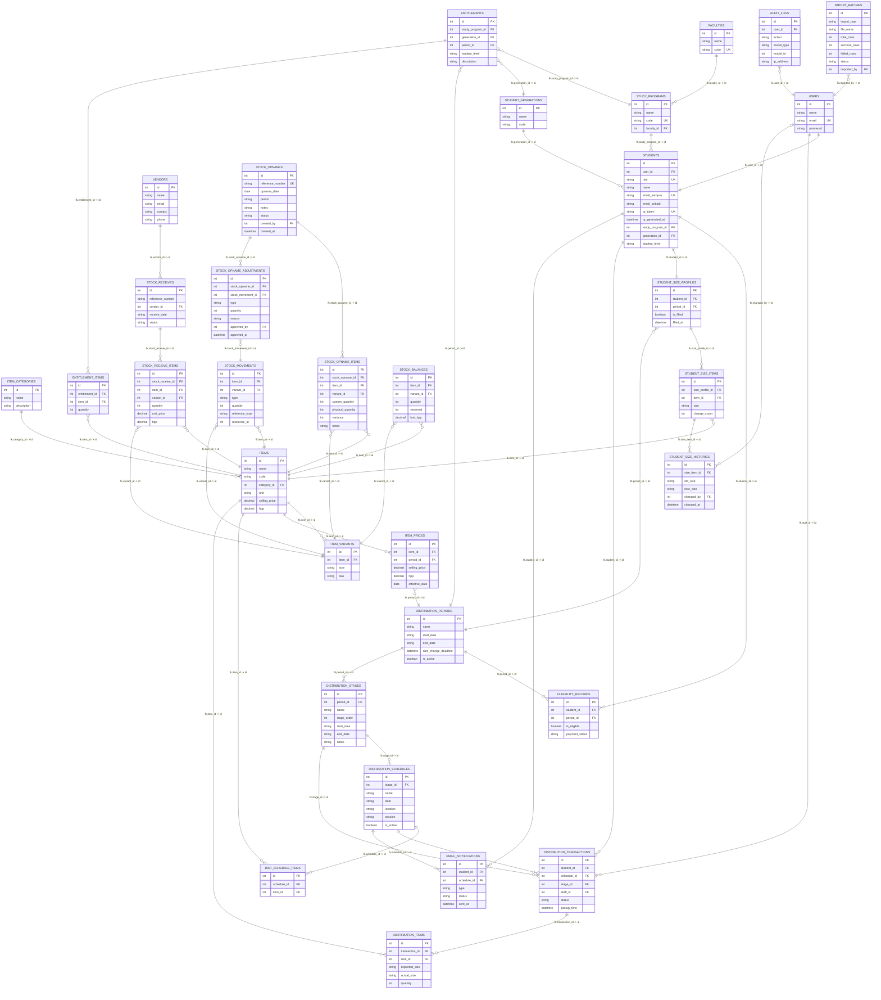

# Database Design — ERD

## Legend Relasi

| Simbol | Arti | Contoh |
|--------|------|--------|
| `||--||` | 1 : 1 | User ↔ Student |
| `||--o{` | 1 : M (zero or more) | Faculty → Study Programs |
| `||--|{` | 1 : M (one or more) | Entitlement → Entitlement Items |
| `}o--o{` | M : M | — |
| `}o--|{` | M : M (mandatory) | — |

## Tipe Data

| Tipe | Keterangan |
|------|-----------|
| `int` | Integer |
| `string` | Teks variable length |
| `text` | Teks panjang |
| `decimal` | Angka desimal |
| `boolean` | true/false |
| `date` | Tanggal saja |
| `datetime` | Tanggal + waktu |
| `json` | Data JSON |
| `FK` | Foreign Key |
| `PK` | Primary Key |
| `UK` | Unique Key |

---

## ERD Lengkap

---

## Detail Tabel

### `users`

| Kolom | Tipe | Keterangan |
|-------|------|-----------|
| `id` | int (PK) | Identifier unik user |
| `name` | string | Nama lengkap |
| `email` | string (UK) | Email login |
| `password` | string | Password ter-hash (bcrypt) |
| `email_verified_at` | datetime | Waktu email terverifikasi |
| `created_at` | datetime | Waktu dibuat |
| `updated_at` | datetime | Waktu diperbarui |

### `faculties`

| Kolom | Tipe | Keterangan |
|-------|------|-----------|
| `id` | int (PK) | Identifier unik |
| `name` | string | Nama fakultas |
| `code` | string (UK) | Kode fakultas (FKIP, FEB) |
| `created_at` | datetime | Waktu dibuat |

### `study_programs`

| Kolom | Tipe | Keterangan |
|-------|------|-----------|
| `id` | int (PK) | Identifier unik |
| `name` | string | Nama program studi |
| `code` | string (UK) | Kode prodi |
| `faculty_id` | int (FK) | Fakultas induk |
| `created_at` | datetime | Waktu dibuat |

### `student_generations`

| Kolom | Tipe | Keterangan |
|-------|------|-----------|
| `id` | int (PK) | Identifier unik |
| `name` | string | Nama generasi (Semester 1, Angkatan 2024) |
| `code` | string | Kode generasi |
| `created_at` | datetime | Waktu dibuat |

### `students`

| Kolom | Tipe | Keterangan |
|-------|------|-----------|
| `id` | int (PK) | Identifier unik |
| `user_id` | int (FK) | Relasi ke akun login |
| `nim` | string (UK) | Nomor Induk Mahasiswa |
| `name` | string | Nama lengkap |
| `email_kampus` | string (UK) | Email @krw.horizon.ac.id |
| `email_pribadi` | string | Email pribadi |
| `qr_token` | string (UK, nullable) | Token QR permanen |
| `qr_generated_at` | datetime | Waktu QR digenerate |
| `study_program_id` | int (FK) | Program studi |
| `generation_id` | int (FK) | Generasi |
| `student_level` | string (FK ke `student_levels.kode`) | Lihat master data Student Level |
| `email_verified_at` | datetime | Waktu verifikasi email |
| `created_at` | datetime | Waktu dibuat |

### `student_levels`

| Kolom | Tipe | Keterangan |
|-------|------|-----------|
| `id` | int (PK) | Identifier unik |
| `kode` | string (UK) | Identifier internal (contoh: `year_1_sem_1`) |
| `label` | string | Label tampilan (contoh: `Year 1 Sem 1 (Freshman)`) |
| `is_active` | boolean | Status aktif |
| `sort_order` | int | Urutan tampilan |
| `created_at` | datetime | Waktu dibuat |
| `updated_at` | datetime | Waktu diupdate |

### `item_categories`

| Kolom | Tipe | Keterangan |
|-------|------|-----------|
| `id` | int (PK) | Identifier unik |
| `name` | string | Nama kategori |
| `description` | text | Deskripsi |
| `created_at` | datetime | Waktu dibuat |

### `items`

| Kolom | Tipe | Keterangan |
|-------|------|-----------|
| `id` | int (PK) | Identifier unik |
| `name` | string | Nama item |
| `code` | string | Kode item |
| `category_id` | int (FK) | Kategori item |
| `unit` | string | Satuan (pcs, pasang, set) |
| `selling_price` | decimal | Harga jual |
| `hpp` | decimal | Harga Pokok Pembelian |
| `created_at` | datetime | Waktu dibuat |

### `item_variants`

| Kolom | Tipe | Keterangan |
|-------|------|-----------|
| `id` | int (PK) | Identifier unik |
| `item_id` | int (FK) | Item induk |
| `size` | string | Ukuran (S, M, L, XL, 40, 42) |
| `sku` | string | Stock Keeping Unit |
| `weight` | decimal | Berat item (opsional) |
| `created_at` | datetime | Waktu dibuat |

### `item_prices`

| Kolom | Tipe | Keterangan |
|-------|------|-----------|
| `id` | int (PK) | Identifier unik |
| `item_id` | int (FK) | Item terkait |
| `period_id` | int (FK, nullable) | Periode harga |
| `selling_price` | decimal | Harga jual periode ini |
| `hpp` | decimal | HPP periode ini |
| `effective_date` | date | Tanggal efektif |
| `created_at` | datetime | Waktu dibuat |

### `vendors`

| Kolom | Tipe | Keterangan |
|-------|------|-----------|
| `id` | int (PK) | Identifier unik |
| `name` | string | Nama vendor |
| `email` | string | Email vendor |
| `contact` | string | Kontak person |
| `phone` | string | No telepon |
| `created_at` | datetime | Waktu dibuat |

### `distribution_periods`

| Kolom | Tipe | Keterangan |
|-------|------|-----------|
| `id` | int (PK) | Identifier unik |
| `name` | string | Nama periode |
| `start_date` | date | Tanggal mulai |
| `end_date` | date | Tanggal akhir |
| `size_change_deadline` | datetime | Batas input/ubah ukuran |
| `is_active` | boolean | Status aktif |
| `created_at` | datetime | Waktu dibuat |

### `distribution_stages`

| Kolom | Tipe | Keterangan |
|-------|------|-----------|
| `id` | int (PK) | Identifier unik |
| `period_id` | int (FK) | Periode induk |
| `name` | string | Nama stage |
| `stage_order` | int | Urutan stage |
| `start_date` | date | Tanggal mulai |
| `end_date` | date | Tanggal akhir |
| `notes` | text | Catatan |
| `created_at` | datetime | Waktu dibuat |

### `eligibility_records`

| Kolom | Tipe | Keterangan |
|-------|------|-----------|
| `id` | int (PK) | Identifier unik |
| `student_id` | int (FK) | Mahasiswa terkait |
| `period_id` | int (FK) | Periode distribusi |
| `is_eligible` | boolean | Status kelayakan |
| `payment_status` | string | Status pembayaran |
| `created_at` | datetime | Waktu dibuat |

### `student_size_profiles`

| Kolom | Tipe | Keterangan |
|-------|------|-----------|
| `id` | int (PK) | Identifier unik |
| `student_id` | int (FK) | Mahasiswa terkait |
| `period_id` | int (FK) | Periode distribusi |
| `is_filled` | boolean | Sudah isi ukuran? |
| `filled_at` | datetime | Waktu isi pertama |
| `created_at` | datetime | Waktu dibuat |
| `updated_at` | datetime | Waktu diperbarui |

### `student_size_items`

| Kolom | Tipe | Keterangan |
|-------|------|-----------|
| `id` | int (PK) | Identifier unik |
| `size_profile_id` | int (FK) | Profil ukuran induk |
| `item_id` | int (FK) | Item yg dipilihkan ukuran |
| `size` | string | Ukuran yg dipilih |
| `change_count` | int | Jumlah perubahan (maks 1) |
| `created_at` | datetime | Waktu dibuat |
| `updated_at` | datetime | Waktu diperbarui |

### `student_size_histories`

| Kolom | Tipe | Keterangan |
|-------|------|-----------|
| `id` | int (PK) | Identifier unik |
| `size_item_id` | int (FK) | Item ukuran terkait |
| `old_size` | string | Ukuran sebelum |
| `new_size` | string | Ukuran setelah |
| `changed_by` | int (FK, nullable) | Student=null, Staff=user_id |
| `changed_at` | datetime | Waktu perubahan |
| `created_at` | datetime | Waktu dibuat |

### `entitlements`

| Kolom | Tipe | Keterangan |
|-------|------|-----------|
| `id` | int (PK) | Identifier unik |
| `study_program_id` | int (FK) | Program studi |
| `generation_id` | int (FK) | Generasi |
| `period_id` | int (FK) | Periode distribusi |
| `student_level` | string (FK ke `student_levels.kode`) | Lihat master data Student Level |
| `description` | string | Deskripsi hak barang |
| `created_at` | datetime | Waktu dibuat |

### `entitlement_items`

| Kolom | Tipe | Keterangan |
|-------|------|-----------|
| `id` | int (PK) | Identifier unik |
| `entitlement_id` | int (FK) | Entitlement induk |
| `item_id` | int (FK) | Item yang diberikan |
| `quantity` | int | Jumlah item |
| `created_at` | datetime | Waktu dibuat |

### `distribution_schedules`

| Kolom | Tipe | Keterangan |
|-------|------|-----------|
| `id` | int (PK) | Identifier unik |
| `stage_id` | int (FK) | Stage distribusi |
| `name` | string | Nama jadwal |
| `date` | date | Tanggal distribusi |
| `location` | string | Lokasi distribusi |
| `session` | string | Sesi/jam |
| `is_active` | boolean | Status aktif |
| `created_at` | datetime | Waktu dibuat |

### `dist_schedule_items`

| Kolom | Tipe | Keterangan |
|-------|------|-----------|
| `id` | int (PK) | Identifier unik |
| `schedule_id` | int (FK) | Jadwal distribusi |
| `item_id` | int (FK) | Item yang dibagikan |

### `distribution_transactions`

| Kolom | Tipe | Keterangan |
|-------|------|-----------|
| `id` | int (PK) | Identifier unik |
| `student_id` | int (FK) | Mahasiswa |
| `schedule_id` | int (FK) | Jadwal |
| `stage_id` | int (FK) | Stage |
| `staff_id` | int (FK) | Staff pelayanan |
| `status` | string | completed/partial/cancelled |
| `pickup_time` | datetime | Waktu pengambilan |
| `notes` | string | Catatan |
| `created_at` | datetime | Waktu dibuat |

### `distribution_items`

| Kolom | Tipe | Keterangan |
|-------|------|-----------|
| `id` | int (PK) | Identifier unik |
| `transaction_id` | int (FK) | Transaksi induk |
| `item_id` | int (FK) | Item yang diambil |
| `expected_size` | string | Ukuran input mahasiswa |
| `actual_size` | string | Ukuran yang diberikan |
| `quantity` | int | Jumlah |
| `created_at` | datetime | Waktu dibuat |

### `stock_receives`

| Kolom | Tipe | Keterangan |
|-------|------|-----------|
| `id` | int (PK) | Identifier unik |
| `reference_number` | string | No referensi |
| `vendor_id` | int (FK) | Vendor |
| `receive_date` | date | Tanggal terima |
| `status` | string | pending/received/cancelled |
| `notes` | string | Catatan |
| `created_at` | datetime | Waktu dibuat |

### `stock_receive_items`

| Kolom | Tipe | Keterangan |
|-------|------|-----------|
| `id` | int (PK) | Identifier unik |
| `stock_receive_id` | int (FK) | Penerimaan induk |
| `item_id` | int (FK) | Item |
| `variant_id` | int (FK) | Varian/ukuran |
| `quantity` | int | Jumlah |
| `unit_price` | decimal | Harga satuan |
| `hpp` | decimal | HPP per batch |
| `created_at` | datetime | Waktu dibuat |

### `stock_movements`

| Kolom | Tipe | Keterangan |
|-------|------|-----------|
| `id` | int (PK) | Identifier unik |
| `item_id` | int (FK) | Item |
| `variant_id` | int (FK) | Varian/ukuran |
| `type` | string | IN / OUT |
| `quantity` | int | Jumlah |
| `reference_type` | string | stock_receive / distribution |
| `reference_id` | int | ID referensi |
| `notes` | string | Catatan |
| `created_at` | datetime | Waktu tercatat |

### `stock_balances`

| Kolom | Tipe | Keterangan |
|-------|------|-----------|
| `id` | int (PK) | Identifier unik |
| `item_id` | int (FK) | Item |
| `variant_id` | int (FK) | Varian/ukuran |
| `quantity` | int | Saldo stok |
| `reserved` | int | Stok di-reserve |
| `last_hpp` | decimal | HPP terakhir |
| `updated_at` | datetime | Waktu diperbarui |

### `stock_opnames`

| Kolom | Tipe | Keterangan |
|-------|------|-----------|
| `id` | int (PK) | Identifier unik |
| `reference_number` | string (UK) | No referensi |
| `opname_date` | date | Tanggal opname |
| `period` | string | Periode ("Agustus 2026") |
| `notes` | text | Catatan |
| `status` | string | draft/completed/adjusted |
| `created_by` | int (FK) | Pembuat batch |
| `created_at` | datetime | Waktu dibuat |

### `stock_opname_items`

| Kolom | Tipe | Keterangan |
|-------|------|-----------|
| `id` | int (PK) | Identifier unik |
| `stock_opname_id` | int (FK) | Batch opname |
| `item_id` | int (FK) | Item |
| `variant_id` | int (FK) | Varian/ukuran |
| `system_quantity` | int | Stok sistem |
| `physical_quantity` | int | Stok fisik |
| `variance` | int | Selisih |
| `notes` | text | Catatan |
| `created_at` | datetime | Waktu dibuat |

### `stock_opname_adjustments`

| Kolom | Tipe | Keterangan |
|-------|------|-----------|
| `id` | int (PK) | Identifier unik |
| `stock_opname_id` | int (FK) | Batch opname |
| `stock_movement_id` | int (FK) | Stock movement |
| `type` | string | surplus / shortage |
| `quantity` | int | Jumlah adjustment |
| `reason` | text | Alasan |
| `approved_by` | int (FK) | Approver |
| `approved_at` | datetime | Waktu approve |
| `created_at` | datetime | Waktu dibuat |

### `import_batches`

| Kolom | Tipe | Keterangan |
|-------|------|-----------|
| `id` | int (PK) | Identifier unik |
| `import_type` | string | students/eligible/items |
| `file_name` | string | Nama file |
| `total_rows` | int | Total baris |
| `success_rows` | int | Berhasil |
| `failed_rows` | int | Gagal |
| `status` | string | processing/completed/failed |
| `error_log` | json | Log error per baris |
| `imported_by` | int (FK) | User pengimport |
| `created_at` | datetime | Waktu import |

### `email_notifications`

| Kolom | Tipe | Keterangan |
|-------|------|-----------|
| `id` | int (PK) | Identifier unik |
| `student_id` | int (FK) | Penerima |
| `schedule_id` | int (FK) | Jadwal terkait |
| `type` | string | event_invite/credentials/password_reset |
| `status` | string | pending/sent/failed |
| `sent_at` | datetime | Waktu terkirim |
| `error_message` | text | Error jika gagal |
| `created_at` | datetime | Waktu dibuat |

### `audit_logs`

| Kolom | Tipe | Keterangan |
|-------|------|-----------|
| `id` | int (PK) | Identifier unik |
| `user_id` | int (FK) | User pelaku |
| `action` | string | create/update/delete/login/export |
| `model_type` | string | Model terpengaruh |
| `model_id` | int | ID model |
| `old_values` | json | Data sebelum |
| `new_values` | json | Data setelah |
| `ip_address` | string | IP address |
| `created_at` | datetime | Waktu aksi |
