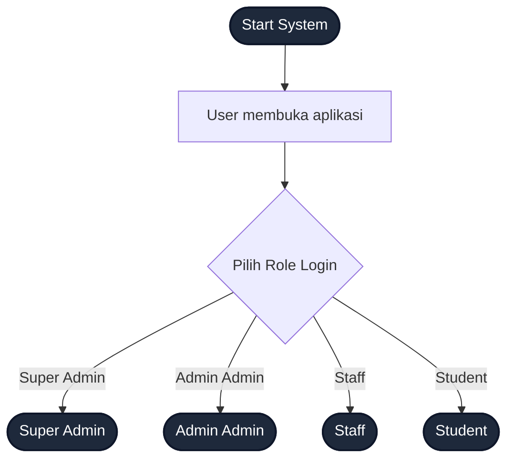
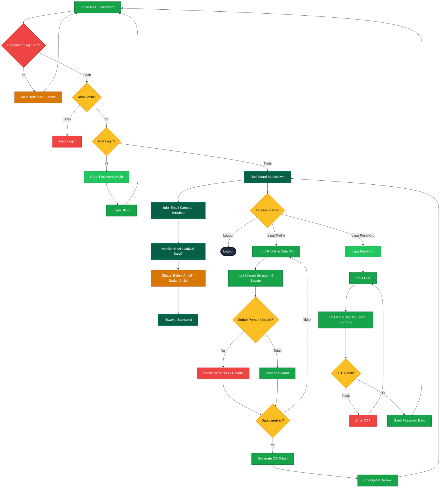
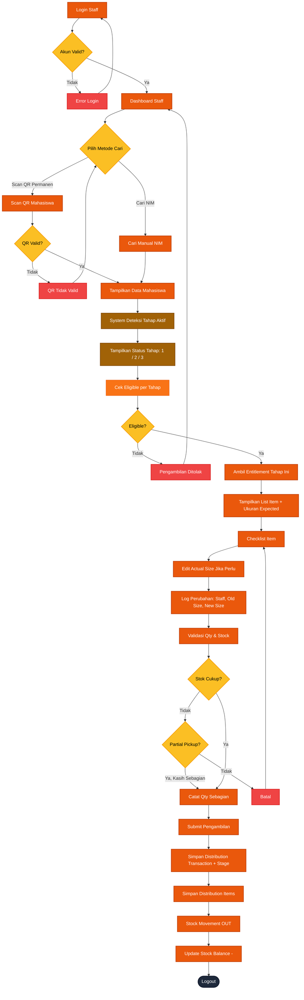
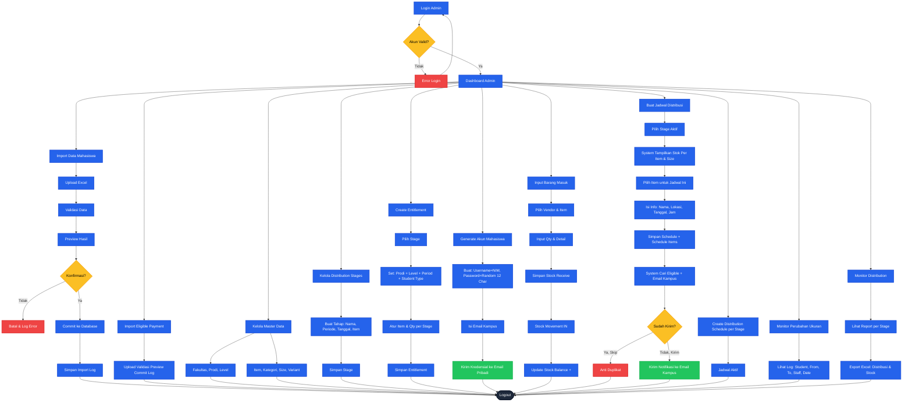
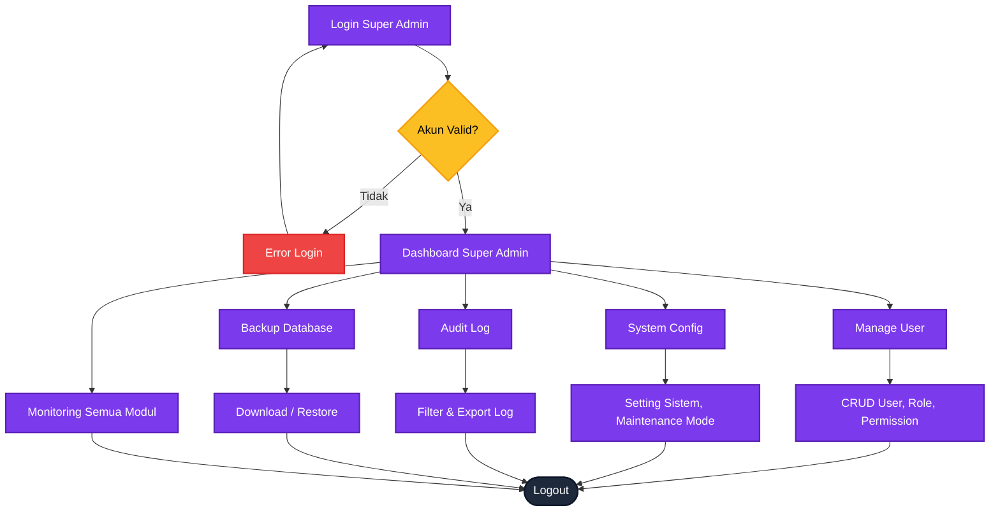
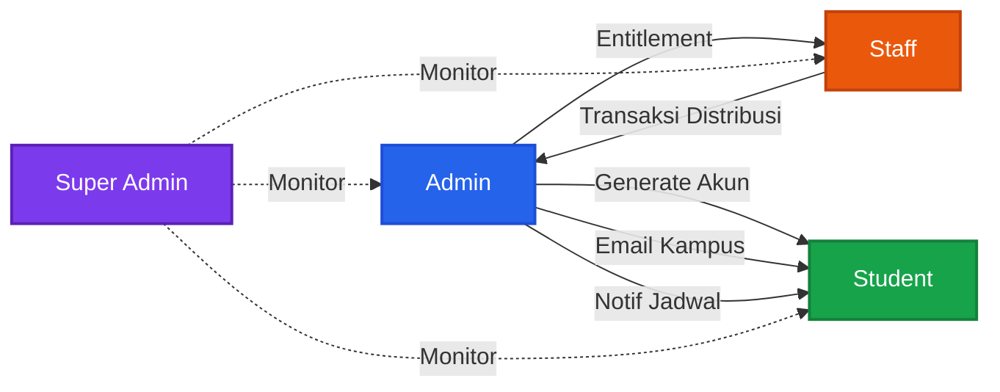

# Flowchart Lengkap Sistem

## Kode Warna Role

| Warna | Role |
|-------|------|
| Ungu | Super Admin |
| Biru | Admin Admin |
| Oranye | Staff |
| Hijau | Student |

---

## 5.1 Flow Start System — Pilih Role

---

## 5.2 Flow Student / Mahasiswa

---

## 5.3 Flow Staff

---

## 5.4 Flow Admin Admin

---

## 5.5 Flow Super Admin

---

## 5.6 Koneksi Antar Role

---

## 6. Penjelasan Flowchart

### 6.1 Alur Mahasiswa

| Langkah | Detail |
|---------|--------|
| Login | Username = NIM, Password = 12 char random dari Admin |
| Batas Login Gagal | Maks 3x, akun terkunci 15 menit |
| First Login | Wajib ganti password |
| Dashboard | Info email, notifikasi, status, riwayat |
| Profile Lengkap | Data diri & ukuran seragam |
| Update Ukuran | Maksimal 1x |
| QR Token | Generate otomatis setelah data lengkap |
| Lupa Password | OTP 6 digit ke email kampus |

### 6.2 Alur Staff

| Langkah | Detail |
|---------|--------|
| Metode Cari | Scan QR atau Cari NIM (fallback) |
| Deteksi Jadwal | System deteksi jadwal aktif |
| Eligible | Cek status pembayaran |
| Actual Size | Staff bisa edit — dicatat log |
| Cek Stok | Validasi sebelum konfirmasi |
| Partial Pickup | Jika stok kurang |
| Transaksi | Simpan, kurangi stok, update balance |

### 6.3 Alur Admin

| Langkah | Detail |
|---------|--------|
| Import | Upload → Validasi → Preview → Commit → Log |
| Stock Receive | Input barang masuk dari vendor |
| Entitlement | Atur hak barang |
| Generate Akun | NIM + password random |
| Buat Jadwal | Pilih stage, item, lokasi |
| Notifikasi | Anti duplikat |
| Report | Export Excel per stage |

### 6.4 Alur Super Admin

| Langkah | Detail |
|---------|--------|
| Manage User | CRUD user, role & permission |
| System Config | Setting global |
| Audit Log | Pantau aktivitas |
| Backup | Backup & restore database |
| Monitoring | Pantau semua modul |
