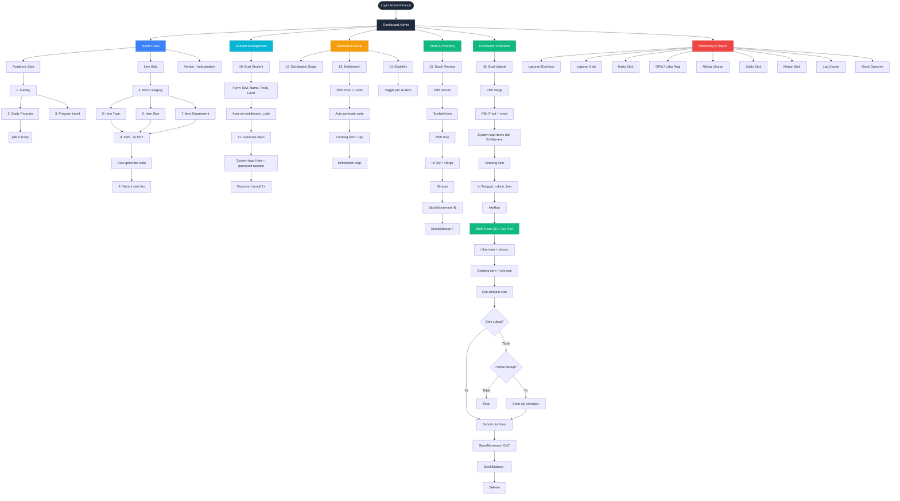

# Alur Admin (Finance) — Via GUI Web

Flowchart ini menggambarkan alur lengkap **Admin/Finance** saat menggunakan aplikasi melalui **GUI Web** (bukan import Excel).

---

---

## Urutan Pengerjaan (Topological Order)

| Level | Yang Dikerjakan | Routes |
|-------|----------------|--------|
| **0** | Faculty, Program Level, Item Category, Vendor | `master-data/*` |
| **1** | Study Program (butuh Faculty), Item Type (butuh Category), Item Size (butuh Category), Item Department (butuh Faculty) | `master-data/*` |
| **2** | Item (butuh Category+Type+Dept+Size), Item Variant (butuh Item) | `master-data/item/*` |
| **3** | Student (butuh Prodi+Level), Distribution Stage, Entitlement (butuh Item+Prodi+Level) | `admin/students/*`, `distribution/*` |
| **4** | Stock Receive (butuh Vendor+Item+Variant), Eligibility (butuh Student) | `inventory/stock-receive/*`, `finance/eligibility` |
| **5** | Distribution Schedule (butuh Stage+Entitlement+Items) | `distribution/distribution-schedule/*` |
| **6** | **Staff** melakukan distribusi (scan/cari NIM) | `distribution/scan` |
| **7** | **Admin** monitor via Reports | `report/*` |

---

## Catatan Penting

1. **Item Code** auto-generate dari kombinasi: `CATEGORY-GENDER-TYPE-DEPT-SIZE`
2. **Entitlement Code** auto-generate dari: `LEVEL_CODE + FACULTY_CODE + PRODI_CODE`
3. **Student entitlement_code** auto-set saat create student berdasarkan Prodi + Level
4. **Stock Balance** bertambah saat Stock Receive, berkurang saat Staff submit distribusi
5. **Distribution Schedule** mengambil items dari Entitlement yang cocok (dicocokkan via code)
6. **Password student** random 12 karakter, muncul 1x di flash message, student wajib ganti saat first login
