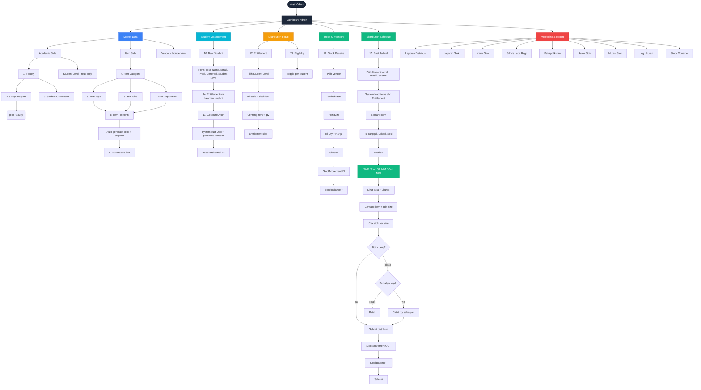

# Alur Admin — Via GUI Web

Flowchart ini menggambarkan alur lengkap **Admin** saat menggunakan aplikasi melalui **GUI Web** (bukan import Excel).

---

---

## Urutan Pengerjaan (Topological Order)

| Level | Yang Dikerjakan | Routes |
|-------|----------------|--------|
| **0** | Faculty, Student Generation, Student Level (read-only), Item Category, Vendor | `master-data/*` |
| **1** | Study Program (butuh Faculty), Item Type (butuh Category), Item Size (butuh Category), Item Department | `master-data/*` |
| **2** | Item (butuh Category+Type+Dept+Size), Item Variant (butuh Item) | `master-data/item/*` |
| **3** | Student (butuh Prodi+Level+Generasi), Entitlement (butuh Item+Student Level) | `student/students-data/*`, `distribution/entitlement/*` |
| **4** | Stock Receive (butuh Vendor+Item+Variant), Eligibility (butuh Student) | `inventory/stock-receive/*`, `finance/eligibility` |
| **5** | Distribution Schedule (butuh Entitlement+Items) | `distribution/distribution-schedule/*` |
| **6** | **Staff** melakukan distribusi (scan/cari NIM) | `distribution/scan` |
| **7** | **Admin** monitor via Reports | `report/*` |

---

## Catatan Penting

1. **Item Code** diisi manual 4 segmen: `KATEGORI-GENDER-TIPE-VARIANT` (contoh: `UNF-L-SCB-02`). SKU varian = `code-SIZE` (5 segmen). Lihat `docs/project/item-code.md`.
2. **Entitlement Code** diisi manual (unique, max 50). Entitlement di-*match* ke student via `student.entitlement_code = entitlement.code` + `entitlement.student_level` (atau `student_level` null = berlaku semua level).
3. **Entitlement** dikelola di `distribution/entitlement/*` (bukan master-data) dan hanya bisa dibuat oleh `super_admin`/`admin`.
4. **Stock Balance** bertambah saat Stock Receive, berkurang saat Staff submit distribusi.
5. **Distribution Schedule** mengambil items dari Entitlement yang cocok (per student level + prodi/generasi).
6. **Password student** random 12 karakter, muncul 1x di flash message, student wajib ganti saat first login (`must_change_password`).
7. Semua route master/inventory/report berada di middleware `role:super_admin|admin`; route scan juga mengizinkan `staff`.